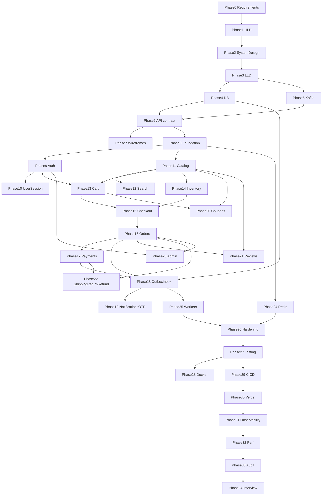

# DEPENDENCY_GRAPH

```mermaid
flowchart TD
  REQ[Phase0 Requirements] --> HLD[Phase1 HLD]
  HLD --> SD[Phase2 SystemDesign]
  SD --> LLD[Phase3 LLD]
  LLD --> DB[Phase4 DB]
  LLD --> EVT[Phase5 Kafka]
  DB --> API[Phase6 API contract]
  EVT --> API
  API --> WF[Phase7 Wireframes]
  API --> FDN[Phase8 Foundation]
  FDN --> AUTH[Phase9 Auth]
  AUTH --> USER[Phase10 UserSession]
  FDN --> CAT[Phase11 Catalog]
  CAT --> SEARCH[Phase12 Search]
  AUTH --> CART[Phase13 Cart]
  CAT --> CART
  CAT --> INV[Phase14 Inventory]
  CART --> CO[Phase15 Checkout]
  INV --> CO
  CO --> ORD[Phase16 Orders]
  ORD --> PAY[Phase17 Payments]
  DB --> OB[Phase18 OutboxInbox]
  ORD --> OB
  PAY --> OB
  OB --> NOTIF[Phase19 NotificationsOTP]
  CAT --> COUP[Phase20 Coupons]
  CART --> COUP
  ORD --> REV[Phase21 Reviews]
  CAT --> REV
  ORD --> SHIP[Phase22 ShippingReturnRefund]
  PAY --> SHIP
  AUTH --> ADMIN[Phase23 Admin]
  ORD --> ADMIN
  FDN --> REDIS[Phase24 Redis]
  OB --> WORK[Phase25 Workers]
  REDIS --> HARD[Phase26 Hardening]
  WORK --> HARD
  HARD --> TEST[Phase27 Testing]
  TEST --> DOCK[Phase28 Docker]
  TEST --> CICD[Phase29 CICD]
  CICD --> VERCEL[Phase30 Vercel]
  VERCEL --> OBS[Phase31 Observability]
  OBS --> PERF[Phase32 Perf]
  PERF --> AUDIT[Phase33 Audit]
  AUDIT --> IV[Phase34 Interview]
```
