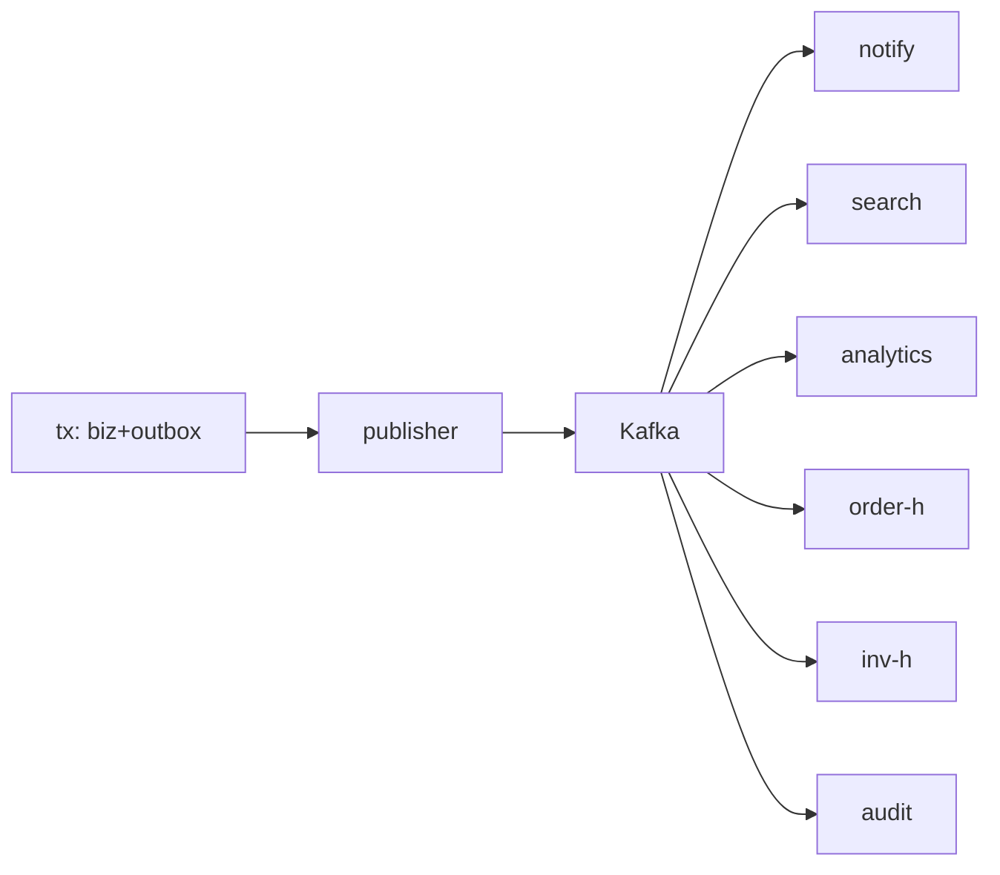

# Flows (15 Mermaid) + Matrices + E2E Trace

Overall: `API-tx → outbox → publisher → Kafka → [notify|search|analytics|order|inventory|audit] → inbox → apply`.

Producer: validate→route→key→headers→send→(fail→PENDING retry). Outbox: PENDING→CLAIMED→SENT/FAILED per reliability. Consumer/inbox: validate→dup-check→tx-apply→PROCESSED→commit. Retry: topic→retry.1m→5m→30m→DLQ. Checkout: sync validate/price/reserve/order-tx then async order.created→payment-starter/inventory/notify. Payment: webhook→verify→tx-confirm→payment.captured→order-handler→PAID→notify. Inventory: reserve→reserved-event→guard; fail→released→checkout-409-compensate. Notify: event→prefs→dedupe→SMTP→sent/failed. Search: catalog-event→versioned-upsert; miss→replay-to-fresh-group; reindex = replay. Analytics: re-read business topics → batch warehouse (never Atlas agg). Replay: new-group from offset/time → idempotent apply, mail-safe via state re-check. Lifecycle: occur→envelope→outbox→publish→consume→inbox→apply/archive. E2E: `POST /checkout (corrId C)` → order-svc tx (eventId E1, causation C) → publisher → order.events → payment-starter (E2, causation E1) → inventory (E3) → notify (mail, dedupe E1) → audit; C/E-chain queryable across logs via corrId.
Matrices: full Event matrix (Event|Producer|Topic|Key|Consumers|Sync-Async|Order|Retry|DLQ) = catalog file; Topic matrix (Topic|Partitions|Key|Producers|Consumers|Retention|Purpose) = topic-design; Retry matrix (Topic|Consumer|Max 5|Delays 1/5/30m|DLQ 30d|Replay new-group+state-recheck) = reliability.
