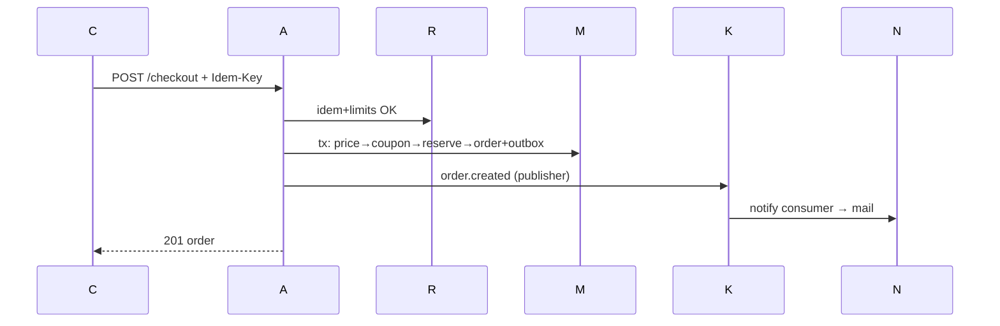

# Diagrams (request lifecycle + boundaries + states + key sequences)

Request: `Client→corrId→security→limit→authN→authZ→Zod→controller→AppService→domain→repo/adapter→mapper→response` (concerns fixed per layer; §README).
Boundaries: HTTP|Application|Domain|Infrastructure with arrows HTTP→App→Domain←Infra.

```mermaid
sequenceDiagram
  C->>A: login
  A->>R: throttle?
  A->>M: verify hash → session+family
  A-->>C: access+refresh
  C->>A: refresh (rotate; reuse→revoke family)
```
States: Order CREATED→PENDING_PAYMENT→PAID→PROCESSING→SHIPPED→DELIVERED (+CANCELLED/FAILED/RETURN_REQUESTED→RETURNED→REFUNDED); Payment INITIATED→AUTHORIZED→CAPTURED/FAILED (+REFUNDING→REFUNDED); Reserve AVAILABLE→RESERVED→SOLD/RELEASED; RMA REQUESTED→APPROVED→PICKED→INSPECTED→REFUNDING→REFUNDED/REJECTED; Session ACTIVE→ROTATED→REVOKED. All guarded by version + actor + event + side-effect (tables in commerce-lld). Class sketch per module: Controller→Service→{Entity, Policy, Machine}→RepoIface←RepoImpl; adapters (Redis/Kafka/Mail/Pay/Ship) implement ports.
