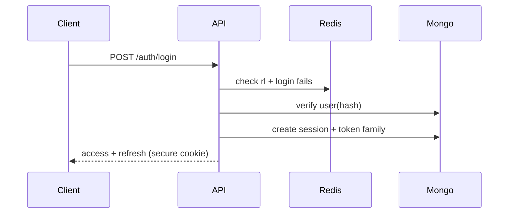
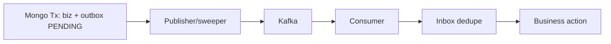

# Phase 0 — Security, Auth/OTP, Kafka/Outbox, API, Concurrency, States, Obs, Deploy, Diagrams

## Security + Threat model
RBAC (customer/staff/support/admin/system) + owner-checks; JWT 15m + rotate + reuse-detect + denylist; argon2/bcrypt; hashed OTP; generic auth errors; Helmet/CORS-allowlist/CSP; CSRF SameSite+token (cookies); XSS escape; Zod anti-NoSQLi; body 100kb; MIME/size upload → S3 presigned; HMAC webhook +5m window + idem; secrets manager; TLS + Atlas-at-rest; audit + security events; npm audit/Snyk/CodeQL/ZAP.
Threats→controls: brute/stuffing→throttle+lock+generic; OTP abuse→limits/cooldown/purpose-split; ATO→rotation/revoke/notify; JWT theft→short TTL/rotation/revoke; hijack→secure cookies+binding-meta; NoSQLi→Zod allowlist; XSS→escape+CSP; CSRF→SameSite+token; spoof/replay→HMAC+window+idem; escalation→RBAC+resource-authz+tests; price-tamper→server-pricing+snapshot; coupon→atomic usage+limits; race→conditional-inc+tx+machine; double-pay→idem+server-verify; scrape/DDoS→limits+WAF+CDN.

## Auth/OTP architecture (no impl)
Register→hash→OTP(EMAIL_VERIFICATION)→verify; Login→throttle→tokens+session; Refresh→rotate→reuse?revoke-family; Logout(-all)→denylist; Reset→OTP(PASSWORD_RESET)→change→revoke-others; Change→reauth→notify.

OTP: crypto-random 6d, 5–10m TTL, SHA256 in Redis, ≤5 attempts, ≤3 resends +60s cooldown, purposes EMAIL_VERIFICATION/LOGIN/PASSWORD_RESET/PHONE_VERIFICATION isolated, single-use invalidate, audit + abuse monitor.

## Kafka/Outbox/Inbox
Envelope: eventId/eventType/eventVersion/occurredAt/producer/correlationId/causationId/aggregateId/payload/metadata.
Topics: order.created/paid/cancelled, payment.succeeded/failed, inventory.reserved/released, notification.send, audit.record, analytics.track (+.DLQ each). Key=aggregateId, partition by key, group per consumer, retries exp+jitter 3–5→DLQ+poison quarantine, inbox dedupe (inboxEvents), retention 7d, versioned schemas+compat, lag alerts.

Needed only cross-domain (order/pay/notify/audit/analytics); unnecessary for single-domain CRUD.

## API standards (`/api/v1`)
kebab resources, proper verbs/codes, Zod→400, cursor paging (`cursor,limit`), filter/sort/search params, URL versioning, `x-correlation-id` in/out, `Idempotency-Key` on checkout/order/pay/refund/webhook, `RateLimit-*` + 429 + Retry-After. Error: `{code,message,requestId,correlationId,timestamp,details?}` — never stacks/tokens/secrets/DB internals.

## Concurrency (intended solutions)
Last-item → conditional `$inc` (one winner, loser 409) + 15m reserve + sweeper release. Dup checkout/pay/webhook/refund → idem keys + unique idx + server-verify. Coupon overuse → atomic usage inc + per-user unique + limits. State transition → guarded machine + version. Kafka dup → inbox dedupe + idempotent handlers. No distributed locks except short coupon lock if proven.

## State machines
```mermaid
stateDiagram-v2
  [*] --> CREATED --> PENDING_PAYMENT --> PAID --> PROCESSING --> SHIPPED --> DELIVERED
  PENDING_PAYMENT --> FAILED
  CREATED --> CANCELLED
  PENDING_PAYMENT --> CANCELLED
  DELIVERED --> RETURN_REQUESTED --> RETURNED --> REFUNDED
```
Inventory: AVAILABLE→RESERVED→SOLD, RESERVED→RELEASED(AVAILABLE) on expiry/fail/cancel/return. Valid/invalid transitions + actor/event/side-effect table in LLD Phase 3.

## Observability / Deployment
Logs JSON + requestId/corrId/traceId; metrics req/err/p50-99/DB/Redis/lag/consumer/checkout/pay/auth/429; OTel API→Mongo→Redis→Kafka→workers→externals; alerts err>2% 5m, p95>1s, lag>1k, infra/auth/pay spikes.
Vercel-first: reuse clients, no consumers/disks/memory-truth; Kafka/Redis/SMTP/S3 managed; Mailpit local; cron→light endpoints + external workers.

## Diagrams index (this phase)
System-context, domain, HLD, module-deps, auth, OTP, rate-limit, checkout, inventory, order-machine, payment, Kafka, outbox, inbox, Redis, deployment, security-boundary — defined above + docs/hld/. Keep readable; detail in Phases 1–3.

## Roadmap validation
PHASE_ROADMAP 0–34 + DEPENDENCY_GRAPH verified: every phase carries Objective/Prereqs/Scope/Out/Tasks/Deps/DB-API-Redis-Kafka-Sec/Testing/Docs/Mermaid/ADR/Acceptance/Risks/Rollback (template docs/architecture/phase-template.md). No gaps; no phase started early. DoP: correct.
