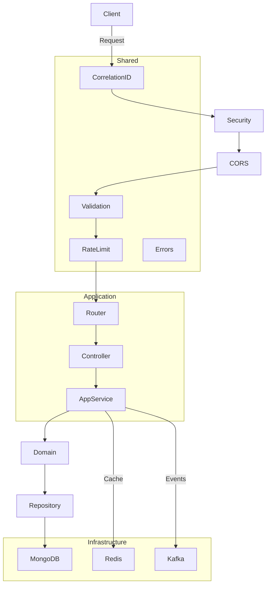
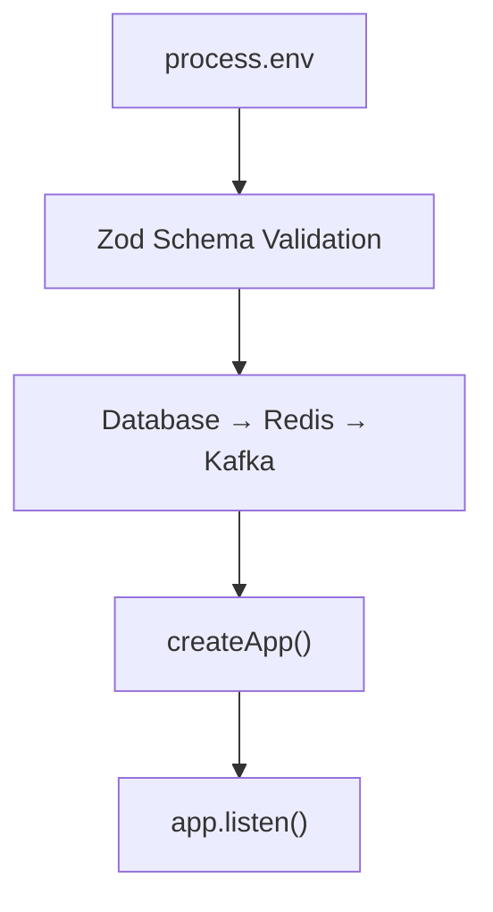
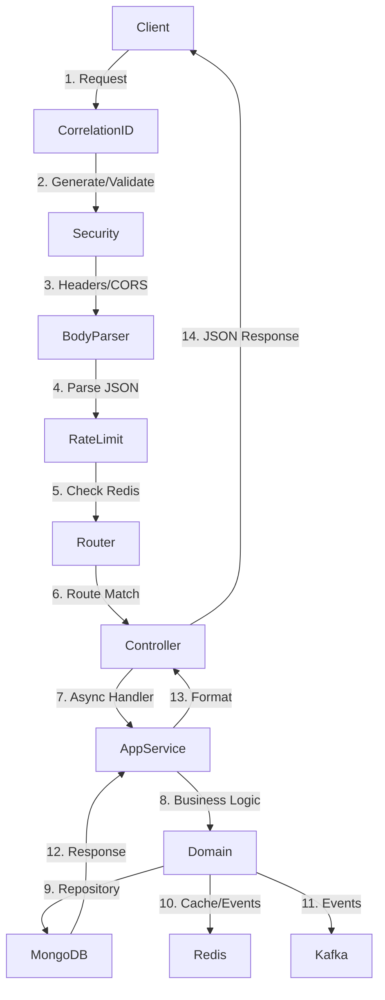
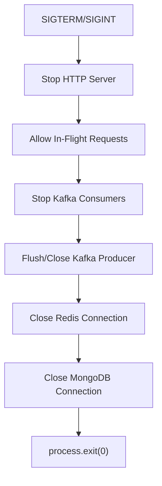

# Backend Foundation — Phase 8

## Overview

The backend foundation establishes the production-quality runtime and architectural infrastructure that all later business modules build upon. It implements a strict Clean/Hexagonal Architecture with modular monolith structure.

## Architecture Diagram



## Startup Flow



### Detailed Startup Sequence

1. **Environment Validation**: All environment variables validated via Zod schemas
2. **Logger Initialization**: Structured logger created
3. **Observability Setup**: Metrics and tracing initialized
4. **Database Connection**: MongoDB Atlas connection established (startup-critical)
5. **Redis Connection**: Redis client connected (startup-critical)
6. **Kafka Client**: Kafka client initialized (non-critical, graceful degradation)
7. **Express App**: Application factory creates Express instance with middleware pipeline
8. **HTTP Server**: Server starts listening on configured port
9. **Signal Handlers**: SIGTERM/SIGINT handlers registered for graceful shutdown

## Request Lifecycle



### Request Flow Details

1. **Correlation ID**: Incoming `X-Correlation-ID` validated; new UUID generated if missing
2. **Security Headers**: Helmet middleware applied (CSP, HSTS, XSS protection)
3. **CORS**: Restricted origin-based CORS policy
4. **Body Parsing**: JSON and URL-encoded body parsing with size limits
5. **Rate Limiting**: Redis-backed sliding window rate limiter
6. **Validation**: Zod schema validation for params, query, headers, body
7. **Controller**: Thin controller delegates to application service
8. **Application Service**: Orchestrates domain logic and infrastructure
9. **Domain**: Core business rules, no infrastructure dependencies
10. **Repository**: Data access abstraction
11. **Response**: Standardized error or success response

## Shutdown Sequence



### Graceful Shutdown Details

1. **Stop accepting new connections**: HTTP server stops listening
2. **Allow in-flight requests**: Configurable timeout (30s default)
3. **Stop Kafka consumers**: Graceful consumer disconnection
4. **Flush/close Kafka producer**: Ensure pending messages are sent
5. **Close Redis**: Proper quit with cleanup
6. **Close MongoDB**: Connection pool cleanup
7. **Process exit**: Clean exit with code 0

## Module Boundaries

```
HTTP Layer          → app.ts, routes.ts, middleware/
Application Layer   → modules/*/app-service/
Domain Layer        → modules/*/domain/
Ports/Interfaces    → modules/*/repository-interface/
Infrastructure      → infrastructure/database/, infrastructure/redis/, infrastructure/kafka/
```

### Forbidden Dependencies

- **Domain → Express**: ❌ Never
- **Domain → MongoDB**: ❌ Never
- **Domain → Redis**: ❌ Never
- **Domain → Kafka**: ❌ Never
- **Controller → MongoDB**: ❌ Never
- **Controller → Redis**: ❌ Never
- **Controller → Kafka**: ❌ Never
- **Application → HTTP-specific**: ❌ Never

## Configuration

All configuration is centralized in `src/config/env.ts` using Zod validation:

- **Required**: MONGODB_URI, REDIS_URL, KAFKA_BROKERS, JWT_ACCESS_SECRET, JWT_REFRESH_SECRET
- **Optional**: SMTP config, CORS_ORIGINS, LOG_LEVEL
- **Defaults**: Safe development defaults only

## Health Endpoints

| Endpoint | Purpose | Checks Dependencies |
|----------|---------|-------------------|
| GET /health | Application status | None |
| GET /health/live | Process liveness | None |
| GET /health/ready | Traffic readiness | MongoDB, Redis |

## Testing

### Unit Tests
- Error architecture
- Validation primitives
- Correlation ID
- Utility functions
- Pagination logic

### Integration Tests
- HTTP application testing with Supertest
- MongoDB connection (using memory server or Docker)
- Redis connection
- Rate limiter primitives

## Vercel Compatibility

The foundation maintains full Vercel/serverless compatibility:

- **Compatible**: Express app factory, middleware pipeline, route registration
- **Must run separately**: Kafka consumers, WebSocket handlers, background workers
- **Connection reuse**: Global clients for MongoDB, Redis, Kafka
- **No in-process consumers**: Kafka workers run on external infrastructure
- **No local storage**: All media/storage uses S3-compatible services
- **No in-memory state**: All state managed via Redis

## Security Controls

- Helmet security headers (CSP, HSTS, XSS filter, no sniff)
- Restricted CORS (origin-allowlisted)
- Body size limits (100kb JSON, 100kb URL-encoded)
- Correlation ID validation (UUID v4 format)
- Sensitive header redaction in logs
- Structured error responses without stack traces
- Rate limiting foundation (Redis-backed)
- No CSRF for stateless bearer token APIs
- No secrets in error responses

## Known Limitations

- Business modules not implemented (auth, products, cart, orders, etc.)
- Kafka consumers not implemented (will be in later phases)
- Swagger UI requires swagger-ui-express (dependency added but not fully configured)
- Rate limiter is foundational; business-specific policies in later phases
- No CI/CD pipeline yet (Phase 29)
- No Docker Compose override for development (Phase 28)

## Interview Topics

This phase demonstrates:

1. **Why modular monolith instead of microservices** - Low ops cost, single deploy, clear extraction path
2. **Why Clean/Hexagonal Architecture** - Testability, separation of concerns, dependency inversion
3. **Why separate app.ts and server.ts** - Testability (import app without starting server)
4. **Why centralized configuration** - Fail-fast validation, no scattered `process.env`
5. **Why Redis instead of in-memory state** - Vercel/serverless compatibility, distributed coordination
6. **Why Kafka consumers cannot live in Vercel** - Serverless constraints (no long-running processes)
7. **Why at-least-once + idempotency** - Practical reliability over theoretical exactly-once
8. **Why correlation IDs** - Distributed tracing, debugging, audit trails
9. **Why centralized error handling** - Consistent API contract, security (no internals leaked)
10. **Why Zod at API boundary** - Type-safe validation, automatic documentation
11. **Why readiness ≠ liveness** - Different failure modes, different responses
12. **Why graceful shutdown** - Data integrity, clean connections, professional operation
13. **Why connection reuse** - Serverless cold starts, resource efficiency
14. **Why infrastructure must not leak into domain** - Testability, portability, maintainability
15. **How architecture evolves at 10x/100x/1000x** - Module extraction, read replicas, caching layers, async processing
