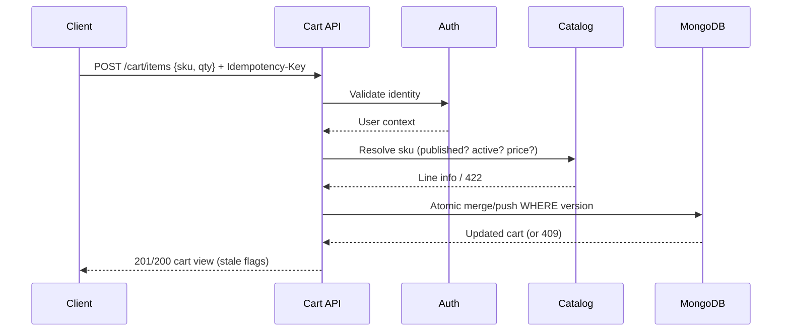

# Cart — Architecture

Modular-monolith slice reusing Phase 8–12 infrastructure:

```text
routes (auth + zod + idempotency)
  → CartController (derives userId from req.user only)
    → CartService (quantity + catalog-purchasability rules)
      → MongoCartRepository (atomic version-guarded updates)
      → MongoCartCatalogAdapter (ProductRepository + VariantRepository)
```

- No direct Mongo Product/Variant access from the service (port boundary).
- No Kafka/outbox: cart mutations have no cross-domain consumer in Phase 13
  (per ADR-009, outbox only where justified). Structured logs carry
  `cart.item_added/updated/removed/cleared` + `cart.concurrency_conflict`.
- Redis: idempotency records only (`idem:cart:{userId}:{key}`, 24h TTL).
  No cart caching; MongoDB is the read source of truth.
- Guest cart: NOT IMPLEMENTED — no approval in Phase 0/6/requirements;
  auth is mandatory. Future point: Redis-backed guest doc + login merge
  (sum quantities, cap 50) reusing `addOrMergeItem`.

Statuses: `active` → `converted` (Phase 15 checkout hook `markConverted`)
| `active` → `expired` (30d TTL index); `expired` → `active` (reactivation
on next write). No marketing/abandoned pipeline in this phase.


