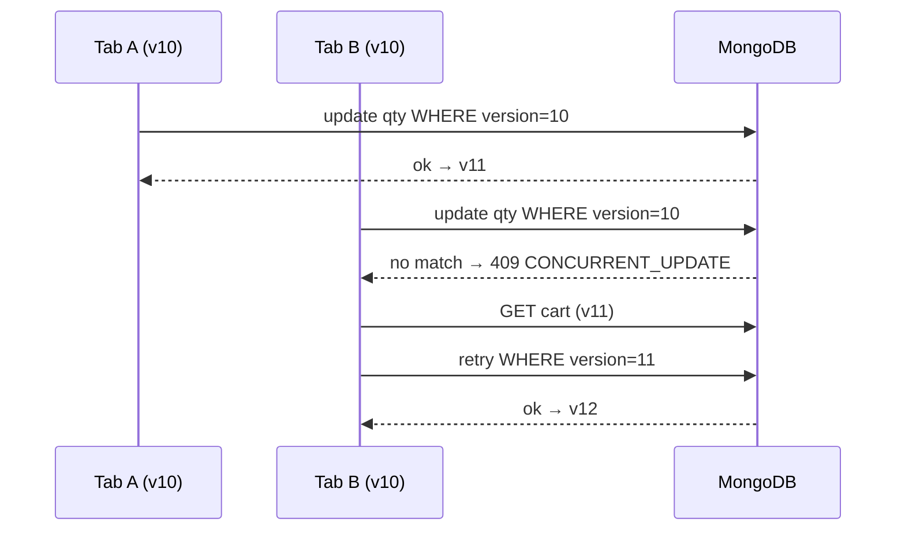

# Cart — Concurrency

Optimistic concurrency on `version` + atomic MongoDB operators. No process-local
locks (serverless-safe).

- Add duplicate: `items.sku`-matched `$inc` (atomic merge); concurrent first-adds
  for a new SKU race on `'items.sku': {$ne}` + version — loser gets 409 and
  retries into the merge path.
- Remove vs update: both version-guarded; loser re-reads (remove of an already
  removed line → 404).
- Retry-after-timeout: safe via `Idempotency-Key` (Redis replay of stored
  response; same key + different body → 409 `IDEMPOTENCY_CONFLICT`).
- Quantity overflow on merge rolls back the `$inc` and returns 422.
