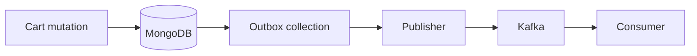

# Cart — Events

No Kafka/outbox publication in Phase 13 (deliberate, per ADR-009: outbox only
for cross-domain async with a real consumer). Cart mutations currently have no
downstream consumer (checkout/orders arrive in Phases 14–16).

```text
Cart mutation → MongoDB (single-doc atomic) → structured log
                                              → (Phase 15: checkout reads cart)
                                              → (Phase 18: cart.* events via existing outbox IF consumers appear)
```

Observable today via logs: `cart.item_added / cart.item_updated /
cart.item_removed / cart.cleared / cart.concurrency_conflict /
cart.validation_failed`. Event flow when enabled later:


