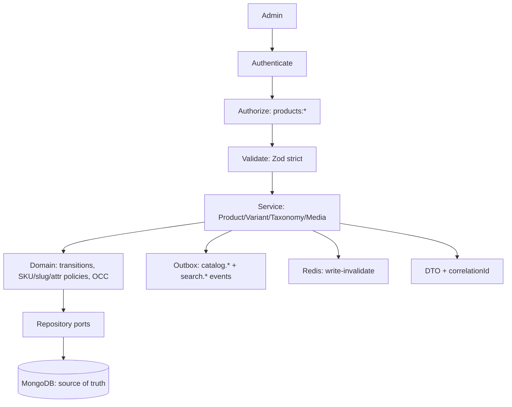
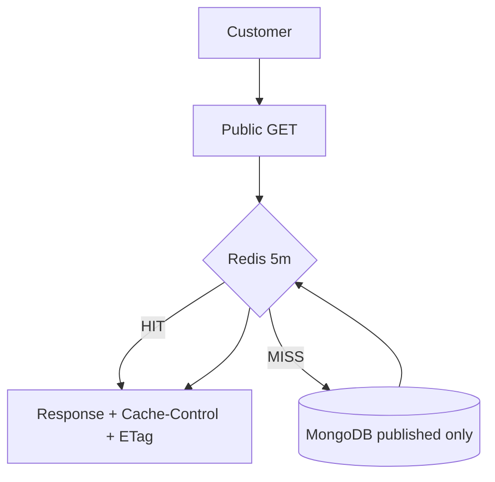
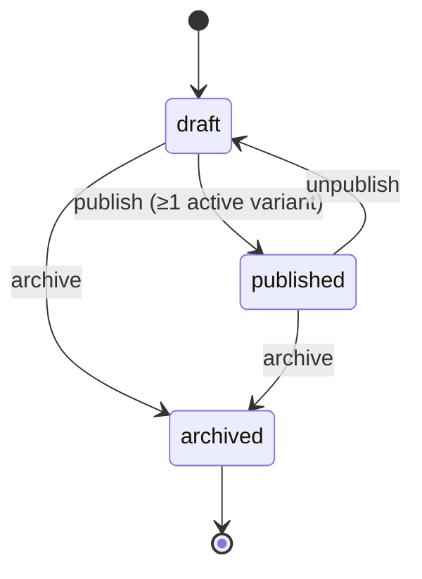
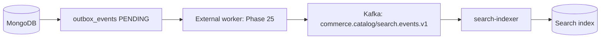

# Catalog Overview (Phase 11)

Owner: `src/modules/catalog` — products, variants, categories, brands, media
references. Single-module layout per `docs/architecture/lld/module-catalog.md`
(`CatalogService, SkuPolicy` own the four collections; search is read-only).

```text
Catalog
 ├── Products      (title, slug, attrs, media refs, status, minPrice projection)
 ├── Variants      (SKU, attrs, priceRef — purchasable unit)
 ├── Categories    (one-level tree + materialized path)
 ├── Brands        (name, slug, logo ref)
 └── Media refs    (S3/CDN pointers only, never blobs)
```

Explicit non-goals: inventory quantities (Phase 14), dynamic pricing (Phase 20),
search engine (Phase 12), cart/orders (later). Catalog exposes two boundaries
for them: `InventoryLookup` port (currently `NullInventoryLookup →
availability: UNKNOWN`) and catalog/search Kafka events.

## Request flow





## Product lifecycle



No raw `PATCH {status}` — state changes only via
`POST /products/:id/publish|unpublish|archive`.

## Future search indexing


