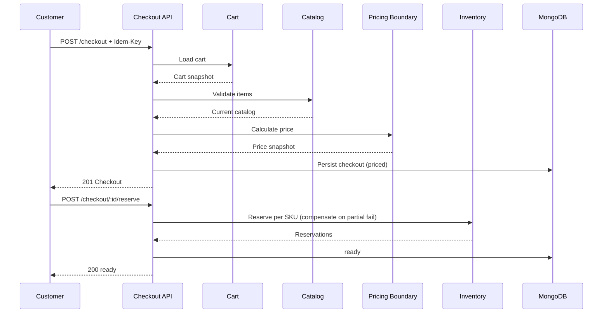

# Checkout — Architecture

Modular-monolith slice reusing Phase 8–14 infrastructure:

```text
routes (auth + zod + idempotency, CHECKOUT 10/m)
  → CheckoutController (userId from req.user; Idempotency-Key required on create)
    → CheckoutService (saga orchestration, no direct Mongo access to other domains)
      → MongoCheckoutRepository (conditional status+version transitions)
      → CartServiceCheckoutCartAdapter (wraps CartService, no cart internals touched)
      → MongoCheckoutCatalogAdapter (ProductRepository + VariantRepository)
      → DefaultCheckoutPricing (subtotal-only; coupon/tax/shipping hooks for Phase 20)
      → InlineCheckoutAddressResolver (snapshot validation; address-book seam)
      → UserServiceCheckoutUserAdapter (customer snapshot via getMe)
      → InventoryServiceCheckoutInventoryAdapter (reserve/release only, actor system)
```

No new database, no new outbox, no new topic, no new rate-limit policy, no
new permission (owner-scoped customer routes + ADMIN/SYSTEM sweep via
existing `requireRole`). No distributed transaction: the saga is local
orchestration with compensating releases (see `inventory-integration.md`).


