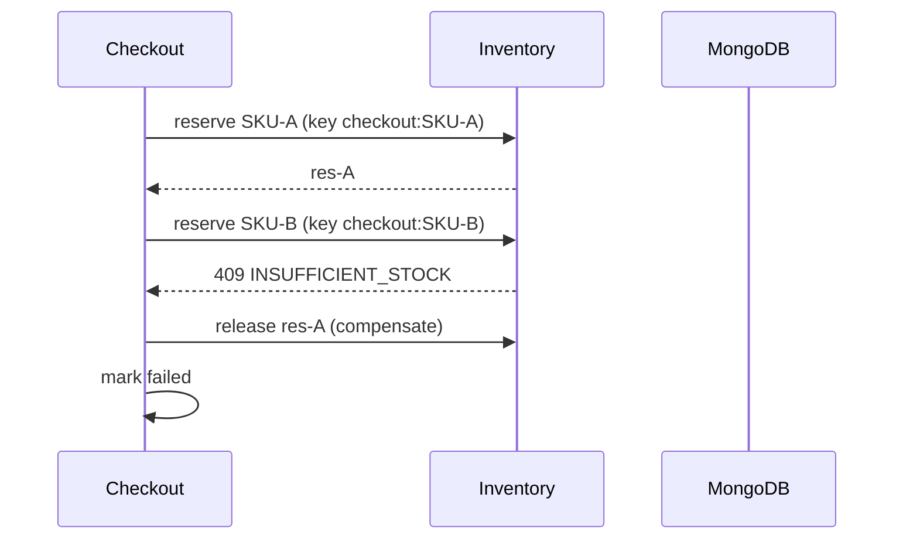

# Checkout — Inventory Integration

Checkout never touches inventory collections. All stock movement goes through
`InventoryService` via `CheckoutInventoryPort { reserve, release }`
(actor `system:checkout:<id>` for the audit trail).

Reserve saga (`priced → reserved → ready`):

- Per-line keys (`<checkoutId>:<sku>`) make retries converge on the same
  reservation instead of double-holding stock — safe across timeouts and
  restarts without Redis.
- Partial failure always compensates successes before marking `failed`;
  the original inventory error (e.g. 409 `INSUFFICIENT_STOCK`) propagates.
- Reservation TTL = remaining checkout life clamped to 60–3600s, so stock
  can never outlive its checkout.
- Cancel/expire/sweep all release through the same idempotent path; double
  release is impossible by Phase 14's state guards.

Cart boundary: adding to cart reserves nothing; checkout reserves everything
at `reserve` time. The cart itself is never locked or mutated by checkout —
only read (with version anchoring) until Phase 16 converts it at order
creation.
