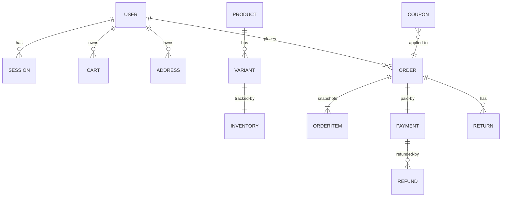
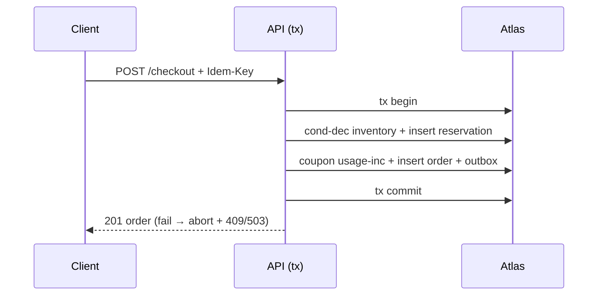

# 08 Diagrams + Model Map + Migrations + Seeds/Test DB

Reads: solid = reference; ORDERITEM = embedded snapshot (not live join). Events (outbox→Kafka→inbox) link notify/audit/analytics, not queryable state.

Concurrent last-SKU: two tx both attempt cond-dec; one matches (available≥qty) → commits; other matches 0 docs → 409 INSUFFICIENT_STOCK; never negative. Outbox flow: tx(biz+PENDING)→publisher CLAIM→Kafka→consumer→inbox dedupe→apply→PROCESSED (boundary: tx covers biz+outbox only; Kafka+ is eventual).
Model map: Collection → Entity → RepoIface → RepoImpl → UseCases → Endpoints (e.g. orders → Order+OrderMachine → OrderRepository → MongoOrderRepository → placeOrder/transitionOrder → POST /orders/checkout, PATCH /orders/:id). Full table in LLD module-catalog; no drift: names identical.
Migrations: additive-only (new optional fields + defaults); indexes built rolling (background) with write-impact review; backfills batched (bulkWrite 1k) + dual-read only when renaming (old+new read, new writes, cutover, drop); destructive changes require export + rollback script. Seeds: admin/customer/products/variants/inv/coupons via script with fake secrets only. Test DB: mongodb-memory for unit; dedicated Atlas-test/Docker for integration with per-test collections + cleanup; deterministic fixtures (fixed skus/users/orderNos).
