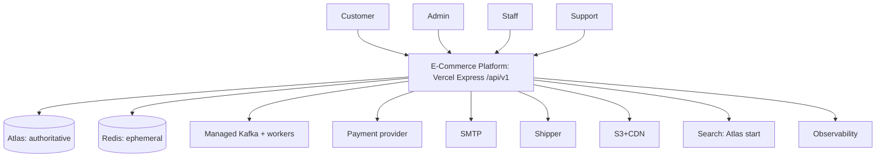

# 01 System Context

In: credentials, catalog queries, cart/checkout commands, idem keys, webhooks (HMAC). Out: tokens, pages, orders/shipments, emails, audit/analytics events. Untrusted: public net/clients/webhooks until verified. Trusted: VPC/managed data with IAM. Authoritative: Atlas for truth; gateway for money state (server-verified); Redis/Kafka never truth.
