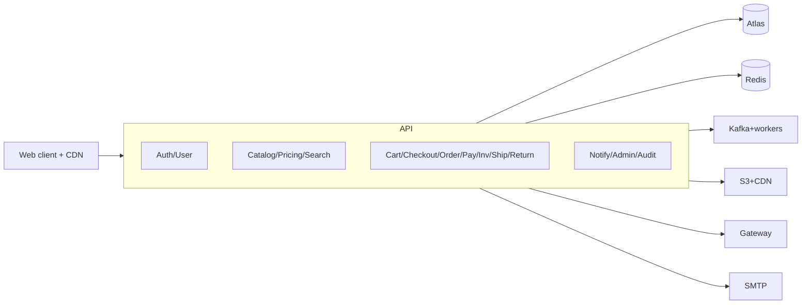

# 02 Container Architecture (logical modules, one deploy)

One Vercel deployment; modules are logical (Phase 0 boundaries). External workers host Kafka consumers/sweepers/cron. No module is separately deployed in v1.
