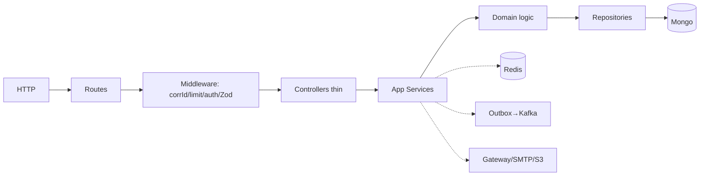

# 03 Component Architecture

Rules: HTTP→App→Domain→Infra only. No logic in routes/controllers/repos; no route→DB; domain never touches HTTP; cross-module via service iface or event. Shared kernel: corrId, errors, paging, money, time, envelope.
