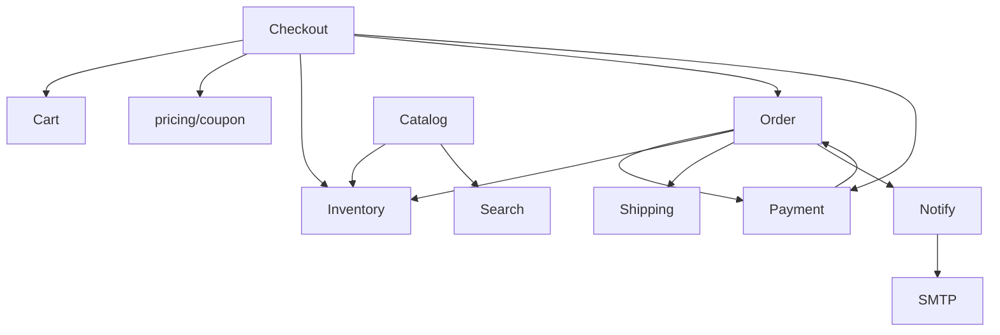

# 04 Domain Architecture + Dependency Rules

Owner/data/events per Phase 0 domain-map (authoritative). Key graph:

Allowed: owner-repo only; checkout/order/pay/inv share tx where atomic; notify/analytics/audit via events. Forbidden: controller→repo, domain→HTTP, bypass joins, shared mutable memory, cycles (CHK never depended upon). Risk: Order↔Payment — break via events + direction Order→Payment commands, Payment→Order status events.
