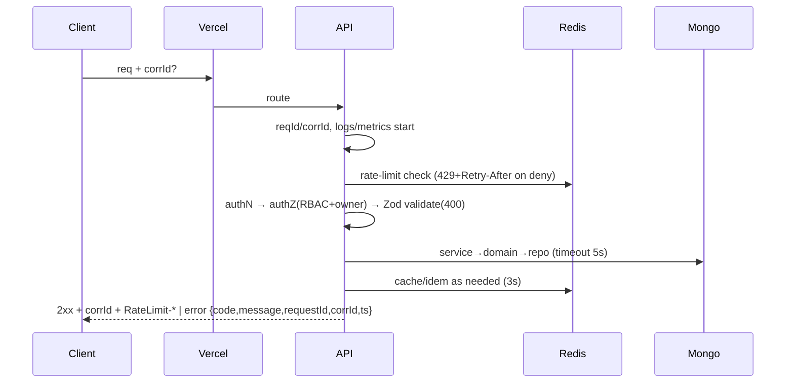

# 05 Request Lifecycle

```mermaid
sequenceDiagram
  Client->>Vercel: req + corrId?
  Vercel->>API: route
  API->>API: reqId/corrId, logs/metrics start
  API->>Redis: rate-limit check (429+Retry-After on deny)
  API->>API: authN → authZ(RBAC+owner) → Zod validate(400)
  API->>Mongo: service→domain→repo (timeout 5s)
  API->>Redis: cache/idem as needed (3s)
  API-->>Client: 2xx + corrId + RateLimit-* | error {code,message,requestId,corrId,ts}
```
Timeouts: DB 5s, Redis 3s, gateway 10s. Errors never leak stacks/secrets. Trace: corrId propagates API→Mongo→Redis→Kafka→workers→externals.
