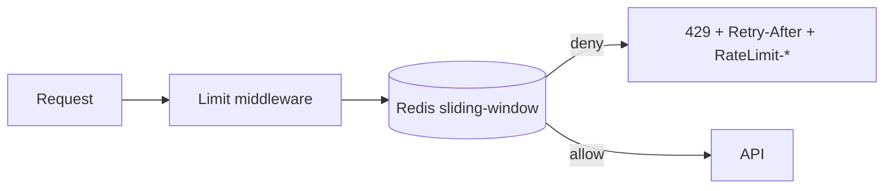

# 06 Rate Limiting

Global 200/m/IP; login 5/15m IP+acct; register 10/h; OTP 4/10m + 5/OTP; reset 3/15m; search 60/m burst10 (token-bucket); cart 60/m; checkout 10/m; pay 5/m; admin 60/m; upload 10/h; webhook 100/m+sig. Keys `rl:{scope}:{id}:{route}`. Fail-closed auth/pay/checkout, fail-open+alert low-risk reads. Monitor 429 rate, auth-fail spikes; tune by p95/abuse.
