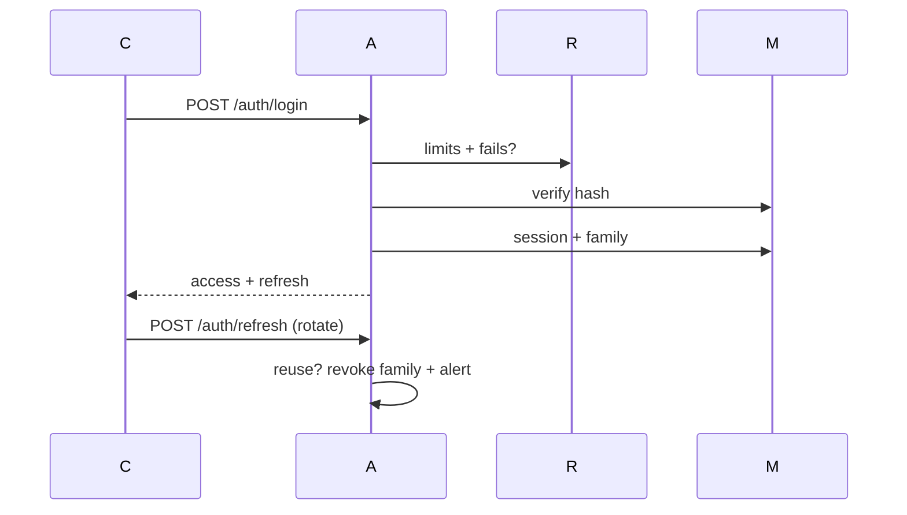

# 07 Authentication

JWT access 15m + rotating refresh (httpOnly/secure) + reuse-detect (family revoke) + session list/revoke + device meta + throttle + generic errors. RBAC roles → permissions; resource-authz owner/admin.

Register→OTP verify; logout(-all)→denylist; reset→OTP→change→revoke-others.
