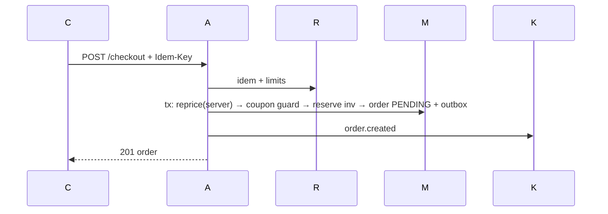

# 08 Checkout

Fails: no-stock→409; pay-fail/timeout→FAILED + release reserve; dup req→replay stored resp; dup webhook→idem; order-fail→tx rollback; event-fail→outbox sweeper retries. Sync: validate/price/reserve/order. Async: notify/analytics.
