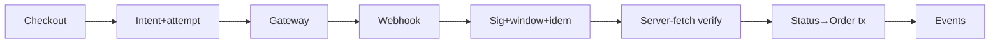

# 11 Payments

```mermaid
flowchart LR
  CH[Checkout] --> PI[Intent+attempt] --> GW[Gateway] --> WH[Webhook] --> SG[Sig+window+idem] --> SV[Server-fetch verify] --> ST[Status→Order tx] --> K[Events]
```
Never trust client. HMAC + 5m window + idem key; dup callbacks deduped; refunds/partial guarded + idem; reconcile cron; failure→FAILED + inventory release.
