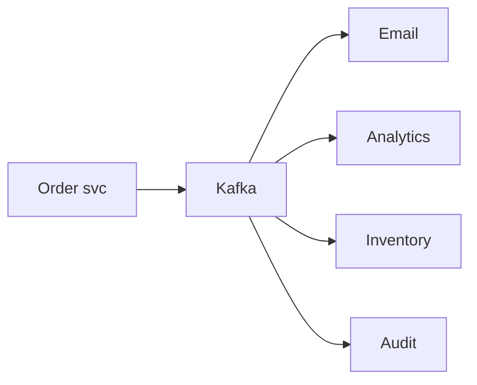

# 12 Kafka

Topics: order.created/paid/cancelled, payment.succeeded/failed, inventory.reserved/released, notification.send, audit.record, analytics.track (+.DLQ). Key=aggregateId; partition by key; group per consumer; retries exp+jitter 3–5→DLQ; retention 7d; versioned envelope; lag alerts.

 Producers: checkout/order/pay. Consumers: notify/analytics/audit/inv-projector (external workers).
