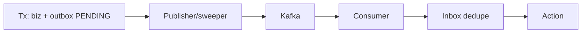

# 13 Outbox/Inbox

```mermaid
flowchart LR
  TX[Tx: biz + outbox PENDING] --> PU[Publisher/sweeper] --> K[Kafka] --> CO[Consumer] --> IN[Inbox dedupe] --> OP[Action]
```
Required: order/pay/notify/audit/analytics fan-out. Not for single-domain CRUD. Retry + poison quarantine + cleanup post-ACK + replay via retention.
