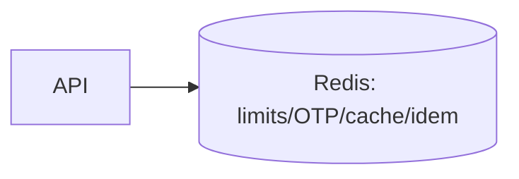

# 14 Redis

Namespaces: `rl:*` limits, `otp:*` + attempts, `login:fail:*`, `cache:*`, `idem:*` 24h, `lock:coupon:*` 5–10s. TTL all; allkeys-lru; not source of truth; fail-closed auth/pay, fail-through cache; hit-rate/latency monitored.

# 15 Caching

Cache-aside; product/cat/config/flags 5–15m; write-invalidate; single-flight anti-stampede; 60s neg-cache; never PII/secrets/tokens. Freshness vs perf: catalog tolerates seconds-stale; pricing/cart/order never cached.
