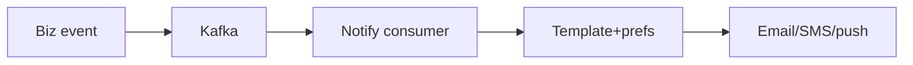
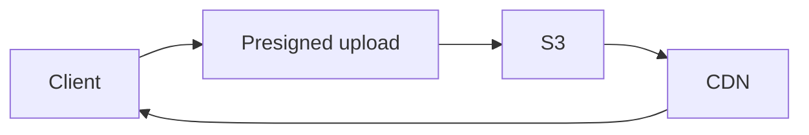

# 15 Caching (see 14) + 16 Notifications + 17 Search + 18 Media

## Notifications

Prefs opt-in/out, dedupe by eventId, retries→DLQ, delivery status + audit.

## Search
Atlas `$text` + filters/facets/sort + cursor page day-1. Migrate to OpenSearch/ES when: facet latency p95>600ms, ranking needs, or index > memory. Trigger metric-gated.

## Media

Mongo stores URLs/meta only; MIME/size validated; CDN serves; delete revokes refs.
