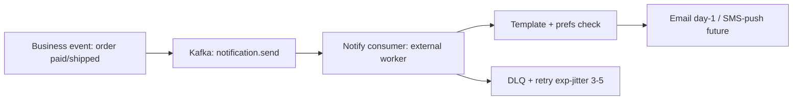

# 16 Notifications

Prefs (`notificationPreferences`): opt-in/out per type/channel; transactional mail always sent. Dedupe by eventId (inbox). Retry → DLQ → ops replay. Delivery status + audit trail stored. Email async only; never blocks checkout/pay responses.
