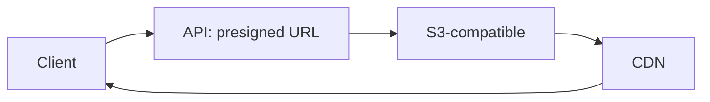

# 18 Media

API validates MIME/size/role, issues presigned PUT; client uploads direct to S3; CDN serves; Mongo stores URLs + metadata only (never blobs). Delete revokes refs + lifecycle policy. Limits: 5MB/image, 10/h/user (rate-limit doc).
