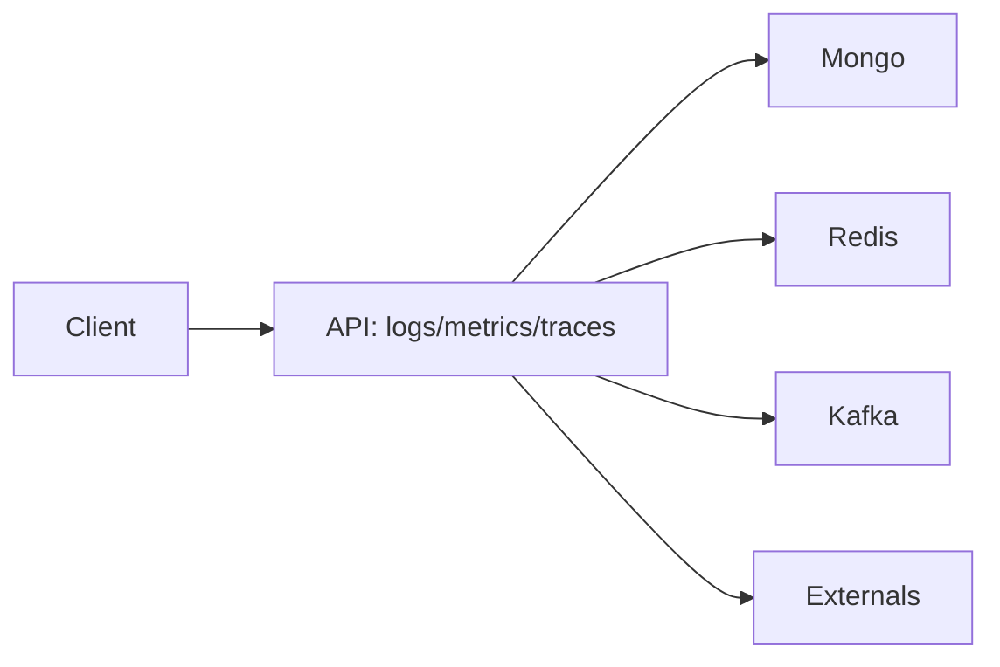
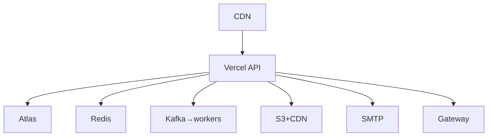

# 19 Security

Trust zones: Internet(untrusted) → Edge(TLS/WAF/limits/CORS) → API(authN/authZ/validate) → Data(IAM/encrypt/audit). Controls: RBAC+owner, JWT rotation/revoke, OTP, Helmet/CSP, Zod anti-NoSQLi, HMAC webhooks, presigned media, secrets manager, audit. Threats mapped in Phase 0; sensitive cuts: auth, pay webhook, admin, checkout.

# 20 Observability

JSON logs + requestId/corrId/traceId; metrics req/err/p50-99/DB/Redis/lag/consumer/429/auth/pay/checkout; OTel; alerts err>2%, p95>1s, lag>1k, infra spikes.

# 21 Failure Handling + Reliability

| Dep | Detect | Timeout/Retry | Fallback | Alert/Recover |
|---|---|---|---|---|
| Atlas | probe/err | 5s, no blind retry on writes | 503 + read-cache (non-money) | page; PITR failover |
| Redis | latency/err | 3s, fail-closed auth/pay | fail-through cache | warn; rebuild |
| Kafka | lag/DLQ | exp+jitter 3–5 →DLQ | queue+degrade notify | page; replay |
| Gateway/mail/ship/S3 | 5xx/timeout | breaker + idem retry | queued/manual reconcile | ticket; reconcile cron |
Backoff exp+jitter; breakers on gateway/mail/search; bulkhead workers vs API; idem everywhere money.

# 22 Deployment

Env: dev → test → staging → prod (separate Atlas/Redis/Kafka/projects+secrets). Scale: serverless horizontal; Atlas/Redis tier; Kafka partitions/consumers; CDN media. Bottlenecks: hot SKU, checkout tx, webhook burst, lag.

# 23 Disaster Recovery

RPO≤5m RTO≤30m (assumptions to validate). Atlas continuous + PITR; Kafka 7d replay; Redis rebuild from truth; Vercel instant rollback + Atlas restore + event replay runbook; dependency outage → degrade table above.

# Sync vs Async / Consistency / Trade-offs

Sync: GET product, validate/price/reserve/order-create, pay-initiate, webhook-verify. Async: notify, analytics, audit, search-index. Why: latency + durability where loss unacceptable vs throughput where eventual OK. Strong: inventory/pay/order-tx. Eventual: notify/analytics/search/dashboards. Trade-offs: limits vs UX (429 tuned), consistency vs throughput (tx minimal), freshness vs perf (short TTL), sync latency vs async complexity (Kafka only cross-domain).
