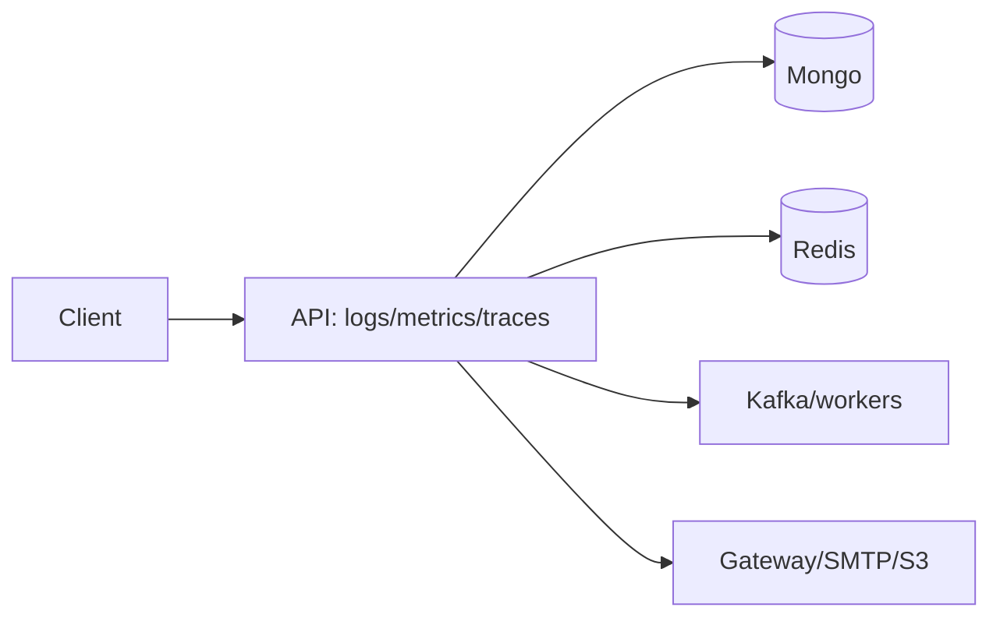

# 20 Observability

IDs: requestId (per req) + correlationId (end-to-end, in/out header) + traceId (OTel). Propagate API→Mongo→Redis→Kafka→workers→externals. Logs JSON; metrics req/err/p50-99/DB/Redis/lag/consumer/429/auth/pay/checkout; alerts err>2% 5m, p95>1s, lag>1k, infra spikes.
