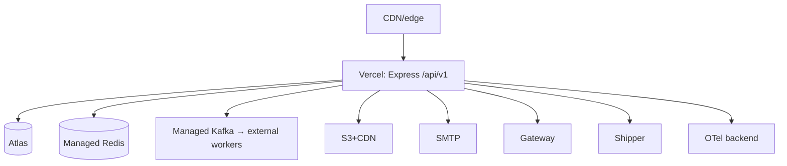

# 22 Deployment

```mermaid
flowchart TB
  CDN[CDN/edge] --> V[Vercel: Express /api/v1]
  V --> A[(Atlas)] & R[(Managed Redis)] & K[Managed Kafka → external workers] & S[S3+CDN] & E[SMTP] & P[Gateway] & SH[Shipper] & O[OTel backend]
```

Envs: dev → test → staging → prod, isolated Atlas/Redis/Kafka/projects/secrets. Promote via preview → prod + instant rollback. No env shares prod data.
