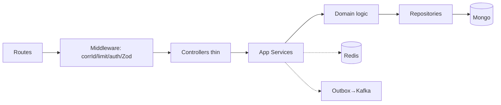
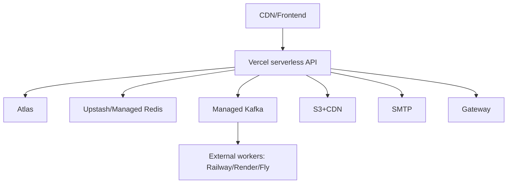

# HLD — High-Level + Component + Deployment + Security

## High-level

## Components
Modules per domain-map; shared kernel only for corrId/errors/pagination/money/time. No cycles, no god service.

## Deployment (Vercel-first)

Vercel: reuse clients via global, no consumers/disks/memory-limits assumed; timeouts noted; cron via Vercel Cron → lightweight sweep endpoints + workers.

## Security boundary
Edge (TLS/CORS/Helmet/429) → identity (JWT rotation/revoke, OTP, throttle) → authZ (RBAC+owner checks) → data (validate/sanitize, HMAC webhooks, encrypted secrets, audit). See docs/security.
