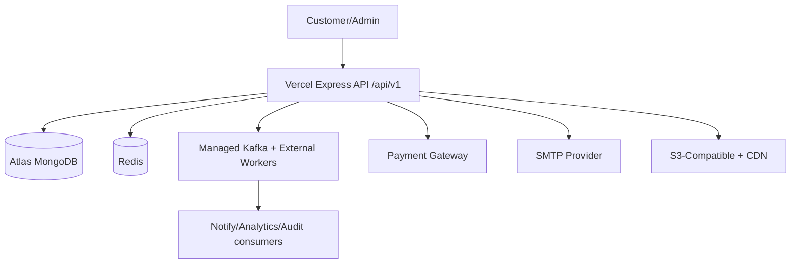

# HLD — System Context

```mermaid
flowchart TB
  U[Customer/Admin] --> V[Vercel Express API /api/v1]
  V --> A[(Atlas MongoDB)]
  V --> R[(Redis)]
  V --> K[Managed Kafka + External Workers]
  V --> P[Payment Gateway]
  V --> M[SMTP Provider]
  V --> S[S3-Compatible + CDN]
  K --> N[Notify/Analytics/Audit consumers]
```

Trust boundaries: public net→Vercel (WAF/TLS/limits) → service (authZ) → data (Atlas/Redis/Kafka with IAM/secrets). No direct client→data.
