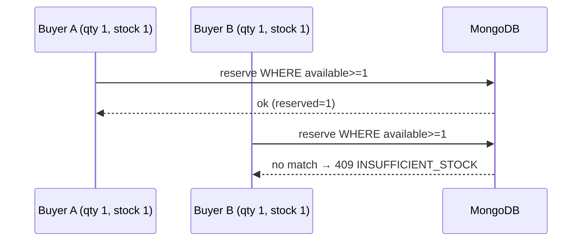

# Inventory — Concurrency

Every stock mutation is a single conditional MongoDB update — the check and
the write are the same operation. There is no read-modify-write anywhere, no
process-local lock, no single-instance assumption.

| Operation                | Atomic guard                                 | Effect                                        |
| ------------------------ | -------------------------------------------- | --------------------------------------------- |
| `reserveStock`           | `$expr: onHand - reserved >= qty`            | `reserved += qty`                             |
| `releaseStock`           | `reserved >= qty`                            | `reserved -= qty`                             |
| `commitStock`            | `reserved >= qty`                            | `reserved -= qty, onHand -= qty, sold += qty` |
| `applyAdjustment`        | `$expr: onHand + delta >= reserved AND >= 0` | `onHand += delta`                             |
| reservation `transition` | `status ∈ from`                              | `status → to`                                 |

Versioning: `version` increments on every mutation for audit/ordering, but it
is intentionally not an optimistic-concurrency guard here — adjustments are
commutative (delta-based, never set-based), and reservations are guarded by
quantity conditions plus state conditions, which are strictly stronger than a
version check for this domain.

Failure ordering is fail-safe: the reservation state transition wins first;
if the follow-on stock step ever fails, stock stays held (a visible leak an
adjustment can correct) rather than released twice (an invisible oversell).
See `failure-handling.md`.

Load evidence: 500 concurrent `reserve(qty 1)` against stock 100 →
100 succeed, 400 get 409, `reserved = 100`, never negative (see
`performance.md`; production atomicity comes from the Mongo conditionals,
whose shape the fake repositories mirror exactly).
