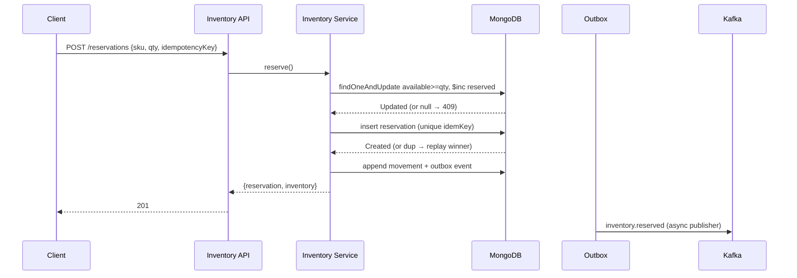
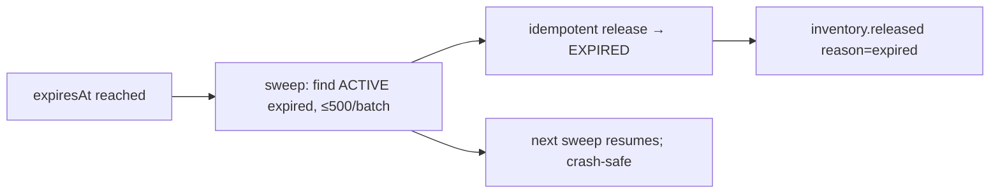

# Inventory — Reservation Lifecycle

```text
AVAILABLE
   ↓ reserve (atomic: available >= qty → reserved += qty)
ACTIVE RESERVATION (expiresAt = now + ttl, default 15m, max 1h)
   ├── confirm → CONFIRMED (reserved → sold, onHand -= qty)
   ├── release → RELEASED (reserved -= qty, stock back)
   └── sweep  → EXPIRED  (same stock effect as release)
```

`RELEASED / EXPIRED / CONFIRMED` are terminal: `RELEASED → CONFIRMED` and
every other post-terminal transition is rejected (confirm on a non-active
reservation → 404; release on any terminal state → idempotent replay).



Expiration (no resident worker — Vercel constraint):



Phase 25 wires a scheduler to `POST /inventory/reservations/expire-sweep`
(or calls `expireReservations` directly); the sweep is re-entrant and each
expiry is individually idempotent, so overlapping or crashed runs converge.
