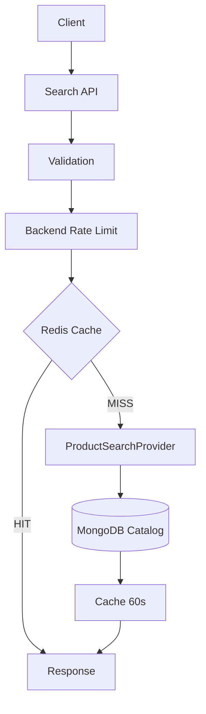
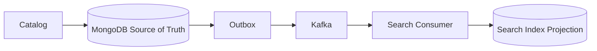
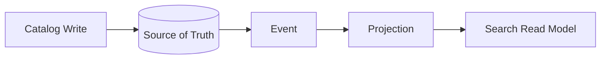
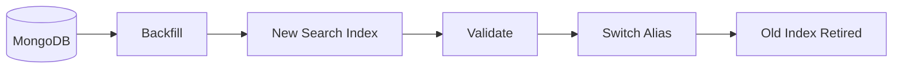

# Search Overview

Phase 12 implements product search and filtering as a read-optimized boundary over Catalog. MongoDB remains the source of truth; search is a projection/read path that can move to OpenSearch/Elasticsearch later by replacing `ProductSearchProvider`.

