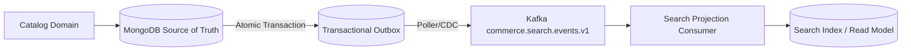
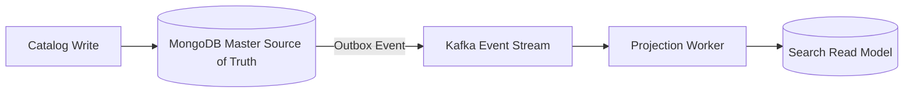
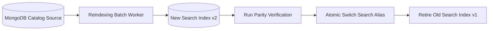

# Search & Filtering Architecture Overview

## 1. Architectural Philosophy

In this production-grade e-commerce platform, **MongoDB remains the authoritative source of truth for the product catalog**. Search is treated strictly as a **read-optimized, derived projection**.

Under no circumstances is the search engine (whether MongoDB index-backed or future Elasticsearch/OpenSearch) treated as the transactional master of product inventory, pricing, or catalog state.

```mermaid
flowchart TD
  Client[API Client]-->API[Search & Filtering API]
  API-->Validation[Strict Zod & Parameter Normalization]
  Validation-->RateLimit[Redis Rate Limiter (60-120 req/min)]
  RateLimit-->Cache{Redis Cache}
  Cache-- HIT -->Response[HTTP 200 Response + Metadata]
  Cache-- MISS -->Provider[ProductSearchProvider Abstraction]
  Provider-->Projection[(Read-Optimized Search Model)]
  Projection-->CacheWrite[Store in Redis (TTL 60s)]
  CacheWrite-->Response
```

---

## 2. Decoupled Provider Port & Adapter Pattern

The application layer (`ProductSearchService`) depends exclusively on the domain port:

```typescript
export interface ProductSearchProvider {
  readonly name: string;
  search(query: SearchProductsQuery): Promise<SearchProductsResult>;
  suggest(query: string, limit: number): Promise<string[]>;
  index(document: SearchProductDocument): Promise<void>;
  update(document: SearchProductDocument): Promise<void>;
  remove(productId: string): Promise<void>;
  healthCheck(): Promise<boolean>;
}
```

This ensures that transitioning from `MongoProductSearchProvider` to an external `OpenSearchProductSearchProvider` requires **zero changes** to:
- HTTP controllers and routes (`catalog.controller.ts`, `catalog.routes.ts`)
- Application services and orchestration (`ProductSearchService.ts`)
- Validation and cursor logic (`search-normalization.ts`)
- Public API contract and OpenAPI specs.

---

## 3. Asynchronous Event-Driven Projection Boundary

When catalog mutations occur (e.g. creating, updating, publishing, unpublishing, or archiving products, or modifying taxonomy and variants), transactional outbox records are created atomically with the database write. A Kafka publisher forwards these events to `commerce.search.events.v1`, which an indexing worker consumes to maintain the derived search index asynchronously.



---

## 4. Search Consistency Model

Search is **eventually consistent**. When a merchant updates a product title or changes a variant price, the transactional read model in MongoDB reflects the change immediately, while the search projection and Redis cache converge within seconds.



---

## 5. Zero-Downtime Reindexing Strategy

When schema updates, mapping changes, or relevance scoring algorithms require a complete reindex, the system executes a blue/green index migration without client interruption.


