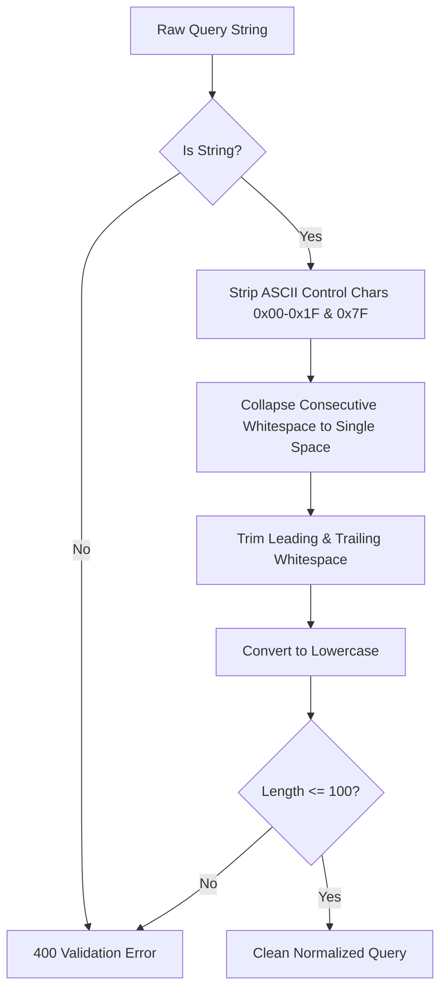

# Search Query Normalization & Input Sanitization

## 1. Objectives

Search queries originate from untrusted public user input. Normalization accomplishes four critical goals:
1. **Relevance Consistency**: Ensuring `" iPhone 15  "` and `"iphone 15"` map to the same search results.
2. **Cache Maximization**: Eliminating whitespace variations so duplicate queries hit the Redis search cache.
3. **NoSQL & Regex Injection Protection**: Stripping control characters and preventing regex operators (`.*`, `$ne`, `__proto__`).
4. **Denial of Service Prevention**: Clamping maximum query length and filter cardinality.

---

## 2. Normalization Steps

### Sanitization Implementation Details
- **ASCII Control Removal**: Strips characters `\u0000` through `\u001F` and `\u007F`, which can cause null-byte injection, terminal control exploits, or parser desynchronization.
- **Space Collapsing**: `replace(/\s+/g, ' ')` ensures that repeated spaces do not alter tokenization.
- **Length Constraint**: Enforces `SEARCH_LIMITS.maxQueryLength = 100`. Queries longer than 100 characters are rejected upfront with HTTP 400.
- **Filter Whitelisting**: Reject arbitrary query parameters like `attributes[$where]=...` or `sort=password`.

---

## 3. Attribute Filter Parsing
Attributes are encoded as `key:value1,value2`.
- Keys must match `^[a-z0-9_-]+$` with maximum length 32.
- Maximum 8 attribute filters per request.
- Maximum 5 values per key.
- Values are deduplicated and trimmed.
