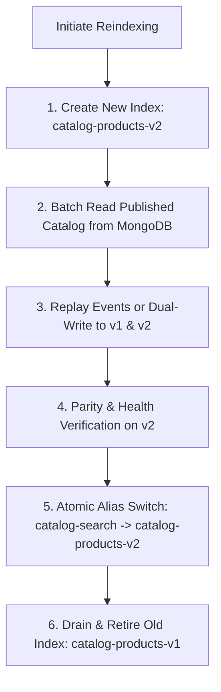

# Zero-Downtime Reindexing & Blue/Green Migration

## 1. When Reindexing is Necessary
A full catalog reindex is required when:
- Updating search analyzer tokenization (e.g. changing n-gram settings, stemmers, or language filters).
- Adding or remapping indexed attributes.
- Tuning BM25 relevance parameters.
- Migrating from MongoDB search provider to OpenSearch cluster.

---

## 2. Zero-Downtime Blue/Green Reindexing Flow

### Key Safety Guarantees
1. **Source of Truth Untouched**: The reindexing process performs read-only cursor scans on MongoDB master/secondaries. Catalog data cannot be corrupted.
2. **Atomic Alias Flip**: Consumers query index alias `catalog-search`. Switching the alias from `catalog-products-v1` to `catalog-products-v2` happens atomically in a single cluster API call with 0ms downtime.
3. **Rollback Capability**: If unforeseen anomalies emerge immediately after the alias flip, the alias can be instantly pointed back to `v1`.
