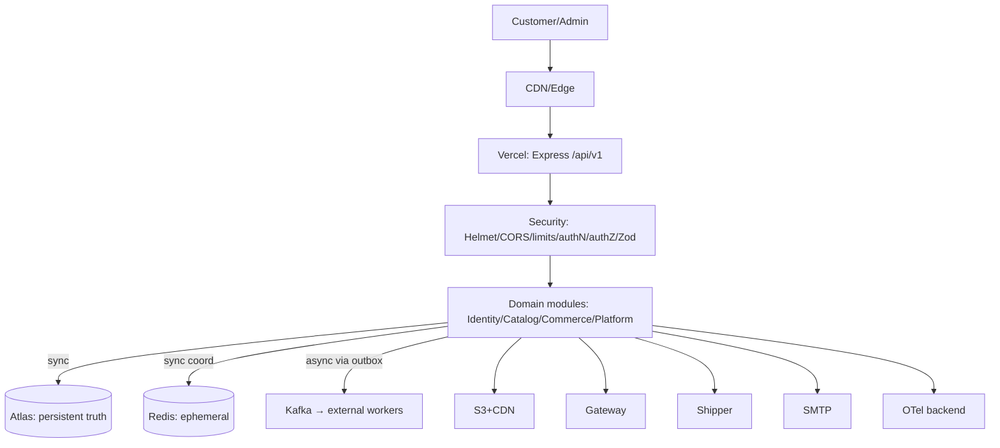

# 01 System Overview (canonical)

Sync paths: reads, cart/checkout-tx, pay-verify, webhook-receive. Async: notify/analytics/audit/search-index via Kafka. Trust: internet untrusted → edge → API → data (IAM). Persistent: Atlas (+gateway money truth). Temporary: Redis/Kafka-transit.
