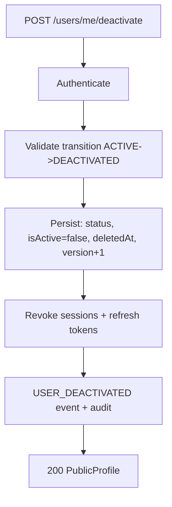

# Account Lifecycle

Statuses: `PENDING_VERIFICATION → ACTIVE → {SUSPENDED, LOCKED, DEACTIVATED}`;
`SUSPENDED/LOCKED → ACTIVE/DEACTIVATED`; `DEACTIVATED` is terminal for
self-service (reactivation is admin-controlled, out of scope).

## Deactivation vs deletion

Deactivation is a soft state change, NOT deletion. Orders, payments, refunds,
and audit records keep their `userId` references; nothing cascades. `isActive`
is set `false` alongside `status` so Phase 9 `login()` keeps rejecting with
`ACCOUNT_LOCKED`, and `getMe`/session endpoints reject with `USER_DEACTIVATED`.
Repeat calls are idempotent (200, no error).

Password change keeps the approved policy: all sessions revoked, fresh
authentication required (no "keep current session" exception).
