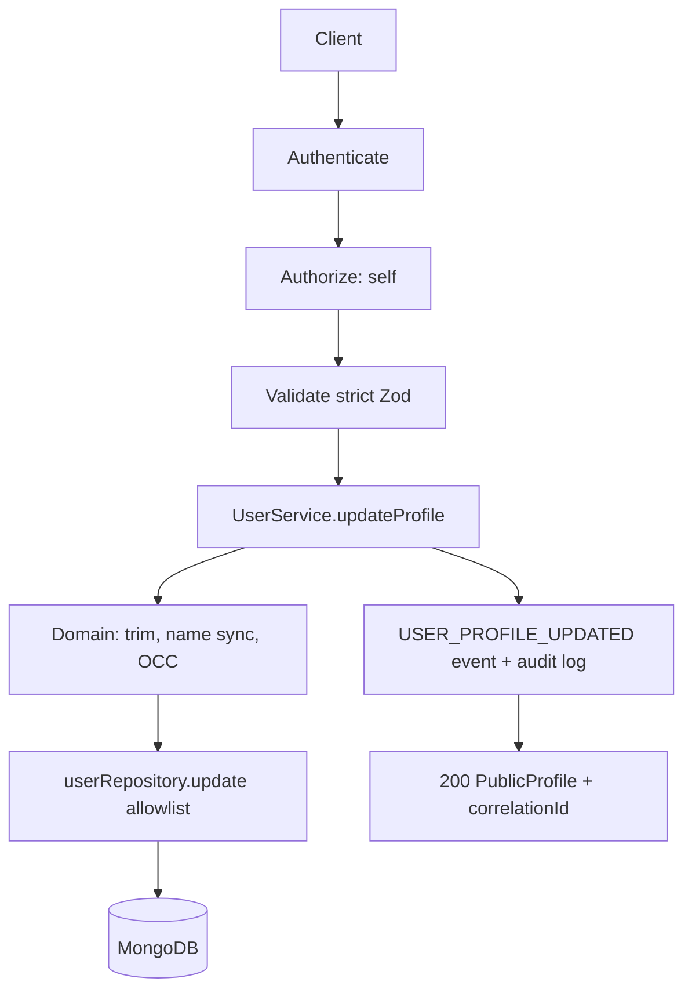

# Profile Management

`GET /api/v1/users/me` returns `PublicProfile` — explicit DTO, never the Mongo
document. `passwordHash`, token hashes, and internal flags are unrepresentable
by construction (`toPublicProfile` picks fields).

## Editable fields

`firstName`, `lastName`, `name` (explicit `name` wins; otherwise synced as
`"<first> <last>"` to keep Phase 9 `name` consumers working). Everything else —
`userId, roles, status, passwordHash, emailVerified, createdAt, security
metadata` — is rejected (400) or ignored by the repository allowlist.

## Email and phone

Email is immutable via this endpoint. Phone changes require the OTP workflow
(`POST /users/me/phone/request` → `POST /users/me/phone/verify`): the OTP
identifier binds `sha256(userId + phone)` so a code issued for one number
cannot verify another. OTP values are never logged or returned.
