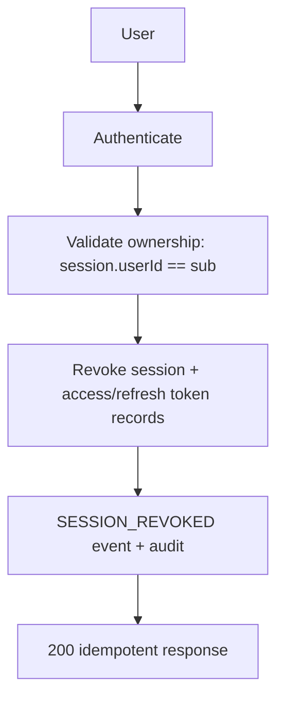
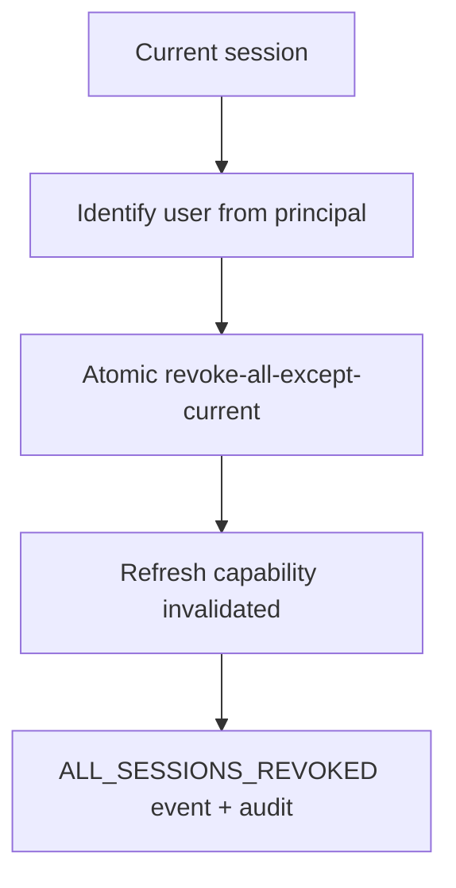

# Session Management

Owner: `src/modules/sessions`. Persistence stays in the auth `sessions`
collection (`SessionRepository` port); Sessions owns the user-facing
application logic. Session identity always comes from the verified token
principal (`req.user.sessionId`), never from IP/UA guessing.

Session record: `sessionId, userId, tokenId (access jti), refreshTokenId,
createdAt, lastUsedAt, expiresAt, isActive`. Raw tokens are never stored in
sessions; token records live in `tokens` (Phase 9 design).

| Method   | Path                                      | Notes                                                     |
| -------- | ----------------------------------------- | --------------------------------------------------------- |
| `GET`    | `/api/v1/users/me/sessions?limit&cursor`  | Safe DTOs only, `current` flag, cursor pagination, 60/min |
| `DELETE` | `/api/v1/users/me/sessions/:sessionId`    | Owner-only 404-safe, idempotent, 20/min                   |
| `POST`   | `/api/v1/users/me/sessions/revoke-others` | Atomic `updateMany` except current                        |

## Logout integration (single mechanism)

- `logout` revokes **only** the current session + its tokens (fixed Phase 9
  behavior that revoked everything).
- `logout-all` / deactivation / password change revoke **all** sessions.
- Refresh rotation links `refreshTokenId → session`: rotation revokes the old
  session and mints a linked successor preserving device metadata; revoked
  sessions cannot refresh (old refresh token is revoked with the session).
