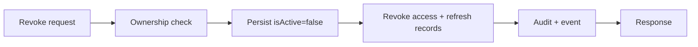

# Session Revocation

- `DELETE /users/me/sessions/:sessionId` requires UUID path param (400
  otherwise), enforces `session.userId === sub` with `404 SESSION_NOT_FOUND`
  for foreign/missing ids (no enumeration oracle), and is idempotent:
  re-revoking returns `{revoked: true, alreadyRevoked: true}`.
- Revocation persists `isActive=false` and revokes **both** the access-token
  record (`tokenId`) and the refresh-token record (`refreshTokenId`), so
  neither token family member survives.
- `POST /users/me/sessions/revoke-others` uses one atomic `updateMany`
  (`_id != current`), returns `{revokedCount, currentSessionId}`, and can never
  revoke the caller.
- Concurrent double-revoke converges on `isActive=false` with no error.
- Expired sessions fall out via the `expiresAt` TTL index; `revokeExpired()`
  covers non-TTL stores.

