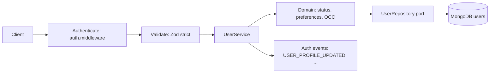

# User Management (Phase 10)

Owner: `src/modules/users`. Auth (`src/modules/auth`) owns identity verification +
token lifecycle; Users owns profile, preferences, and account lifecycle. No
duplication: both modules share the `users` collection and the `UserRepository`
port; Users reuses auth infrastructure adapters (Mongo repositories, OTP, events).

## Endpoints

| Method  | Path                             | Auth   | Description                                                                            |
| ------- | -------------------------------- | ------ | -------------------------------------------------------------------------------------- |
| `GET`   | `/api/v1/users/me`               | Bearer | Current public profile                                                                 |
| `PATCH` | `/api/v1/users/me`               | Bearer | Update profile (`firstName`, `lastName`, `name`, `version`) — strict allowlist, 30/min |
| `GET`   | `/api/v1/users/me/preferences`   | Bearer | Notification preferences                                                               |
| `PATCH` | `/api/v1/users/me/preferences`   | Bearer | Update preferences (`securityNotifications` forced on)                                 |
| `POST`  | `/api/v1/users/me/phone/request` | Bearer | OTP for phone change (5/10min, fail-closed)                                            |
| `POST`  | `/api/v1/users/me/phone/verify`  | Bearer | Verify OTP, update phone                                                               |
| `POST`  | `/api/v1/users/me/deactivate`    | Bearer | Soft deactivation (5/hour, fail-closed)                                                |

Email change is intentionally NOT a `PATCH` field. No verified email-change
workflow is approved yet (see `account-lifecycle.md`); direct email mutation
would enable account takeover.

## User model (additive over Phase 9)

`users` collection keeps `_id, email, passwordHash, name, isEmailVerified,
isActive, roles, lastLoginAt, timestamps` and adds `firstName, lastName, phone,
phoneVerified, status, preferences, version, deletedAt`.

## Mass assignment protection

`PATCH /users/me` uses `.strict()` Zod schemas: `roles`, `status`,
`passwordHash`, `emailVerified` are rejected with 400 before reaching the
service. The service maps only `firstName/lastName/name` into
`userRepository.update()`.

## Optimistic concurrency

`version` increments on every profile/preference/phone/deactivation write.
Clients may send `version`; mismatch yields `409 CONCURRENT_UPDATE`.
