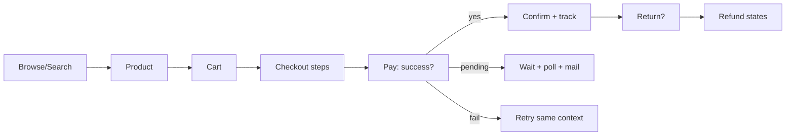
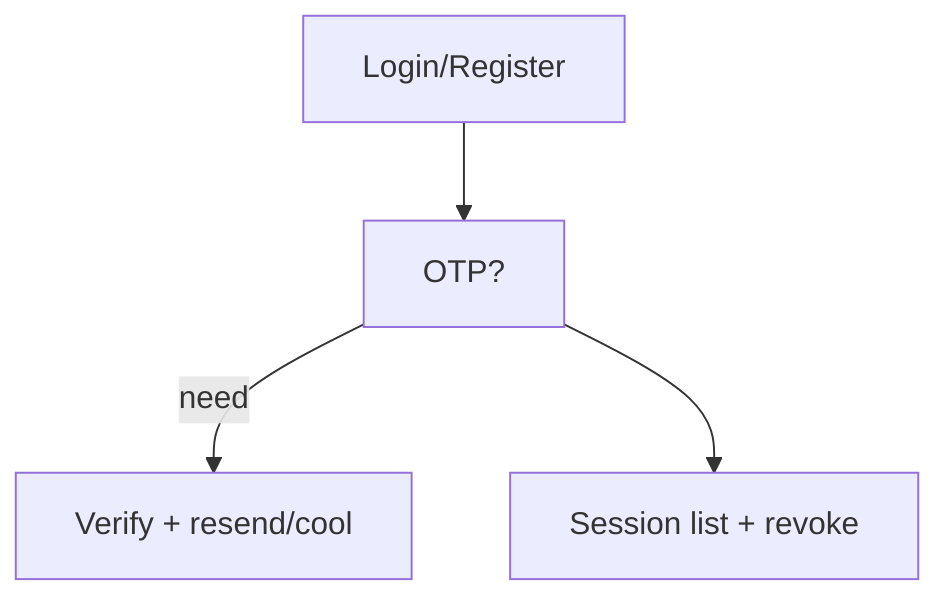

# API Mapping + Backend-State→UI + Async UX + Flows + Interview

Screen→API (all Phase 6, nothing invented): Home `GET /products|/search` · Listing/Search `GET /products|/search` · Detail `GET /products/{slug} + /reviews` · Cart `GET/POST/PATCH/DELETE /cart…` · Checkout preview/validate/commit `POST /checkout/…` (+Idempotency-Key) · Orders `GET /orders… + POST cancel` · Pay `POST/GET /payments…` (webhook server-side) · Returns `POST /orders/{id}/returns + GET /returns…` · Reviews `GET/POST/PATCH/DELETE /…reviews` · Notify `GET/PATCH /notifications…` · Auth `POST /auth/…` + `/sessions` · Addresses CRUD · Media `POST /media/upload-url` (admin) · Admin `GET/POST /admin/…` per resource.
State→UI: PENDING_* amber + Cancel · PAID/PROCESSING blue · SHIPPED tracking-link · DELIVERED green + Return≤30d · CANCELLED/FAILED grey/red + reorder · RETURN_* purple + refund card (pending/processing/completed/failed + amount + last4 + ETA) · payment PENDING polls, never success-claimed early · inventory LOW/OUT badges gate qty · notify pending vs delivered distinguished.
Async: pending states poll with backoff + email-push fallback; search lag banner; analytics "hourly" labels; refund/return trackers event-driven (no fake instant-done).
Flows (20): guest-browse → register → login → OTP → search → select → cart → checkout → pay → confirm → track → cancel → return → refund → review → account → admin-product → admin-inv → admin-order → admin-RMA.

Admin product/order lifecycles mirror backend machines (draft→published→archived; order states) with gated buttons only.
Interview answers: UI renders machine states (never invents actions) · pending-pattern + idem-context for async · inv-change banner + re-confirm · 409 → diff + reload, never silent overwrite · 429 countdown + no retry-spam · silent-refresh → return-to login · tables→cards + sheets + AA contrast + live-regions · browser stores access-memory-only, refresh in HttpOnly cookie, nothing sensitive in localStorage · REST-mapped 1:1, cursor pages, no chatty polling (backoff) · optimistic UI only for wishlist/read toggles with rollback; money always server-confirmed · frontend never trusted (prices/states re-validated server-side).
Security/privacy: no tokens/OTPs/secrets rendered or logged; payment shows last4 only; audit corrId expandable; PII minimized in telemetry.
