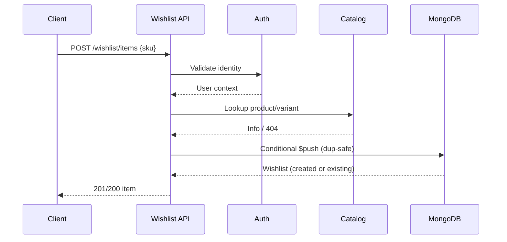

# Wishlist — Architecture

```text
routes (auth + zod + idempotency)
  → WishlistController (userId from req.user only)
    → WishlistService (lookup + graceful-state enrichment)
      → MongoWishlistRepository (conditional $push, $pull)
      → MongoWishlistCatalogAdapter (ProductRepository + VariantRepository)
```

- No Kafka/outbox (no cross-domain consumer in Phase 13, per ADR-009).
- Redis: idempotency records only (`idem:wishlist:*`, 24h TTL).
- Duplicate safety at two levels: app pre-check + conditional
  `findOneAndUpdate` with `$nor` on `(productId,variantId)` / `(productId,sku)`,
  so concurrent duplicate adds collapse to a single line (dup → 200).
- Pagination: cursor over `(addedAt DESC, itemId DESC)`, limit 1–50.


